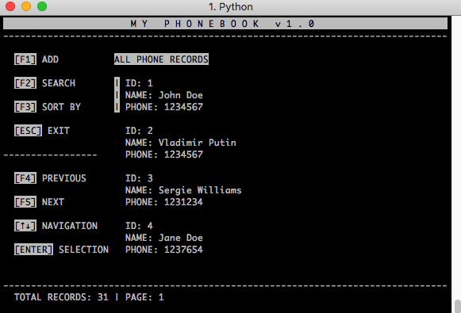

# Phonebook

An "old school" phonebook in terminal using the curses library and saves data to a flat file.

- A simple phonebook C-R-U-D (Create, Read, Update and Delete) in flat-file
- written in Python 3
- uses the curses library
- terminal size must be 80x25 or greater

To run the program:

$ python3 app.py

